# 群日记管理系统

一个本地的、多人共用的日记管理程序。日记本身是**纯文本文件**，格式和你原来的一模一样；
程序提供图形界面来记录、检索、筛选、朗读式阅读，并带背景音乐与 GitHub 同步。

```
2026.7.13 伊丝塔
1.鲸鱼娘好可爱
2.deepseek娘好厉害
END
```

---

## 界面预览

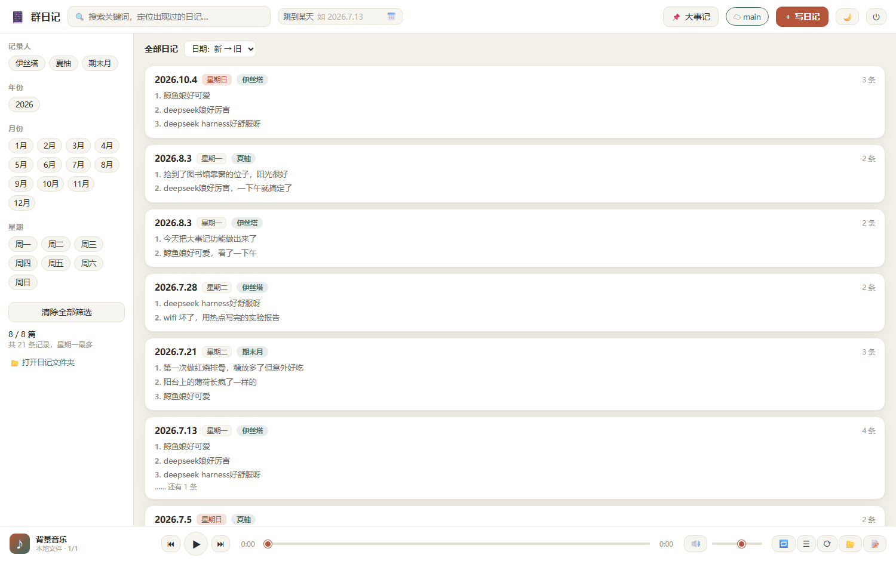

| | |
|---|---|
| 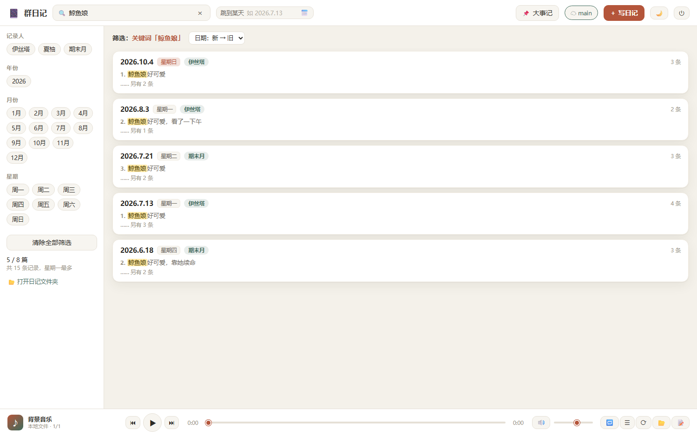 | 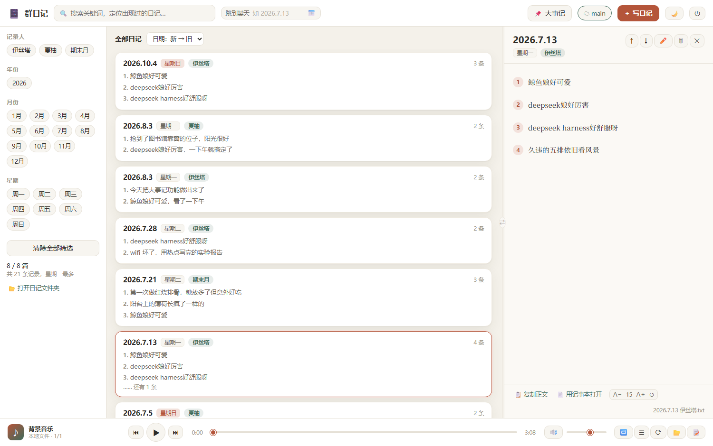 |
| 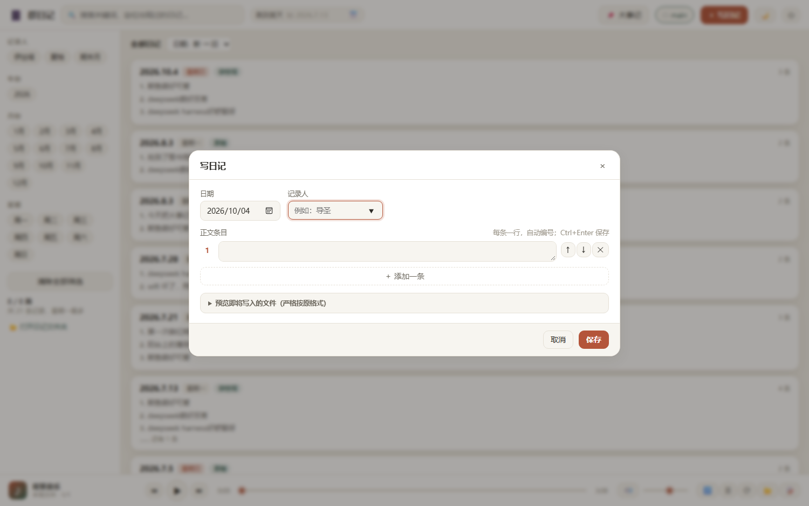 | 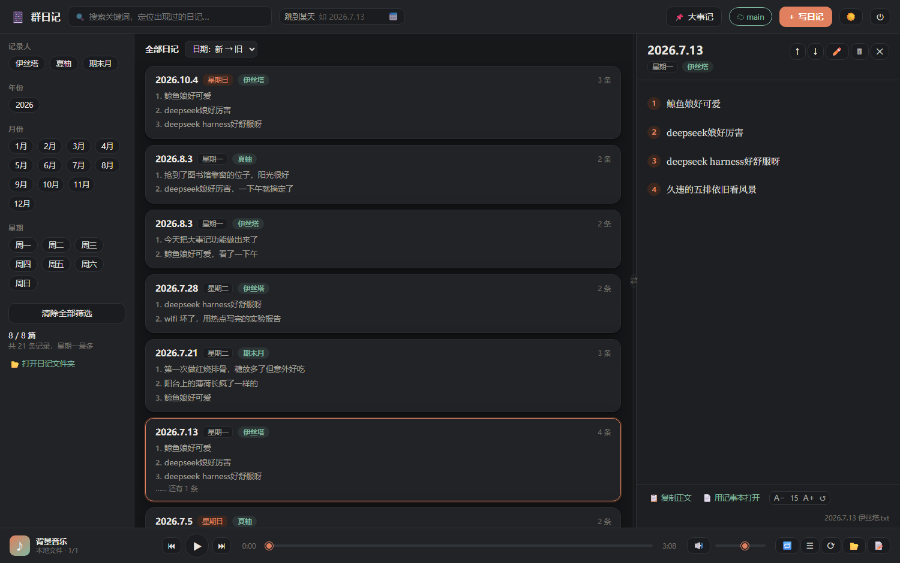 |
| 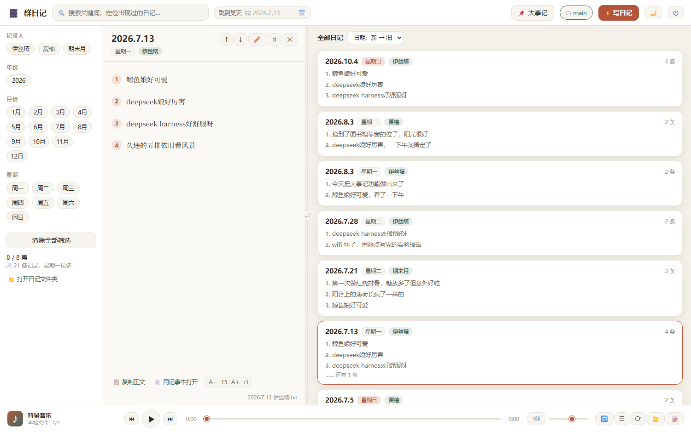 | 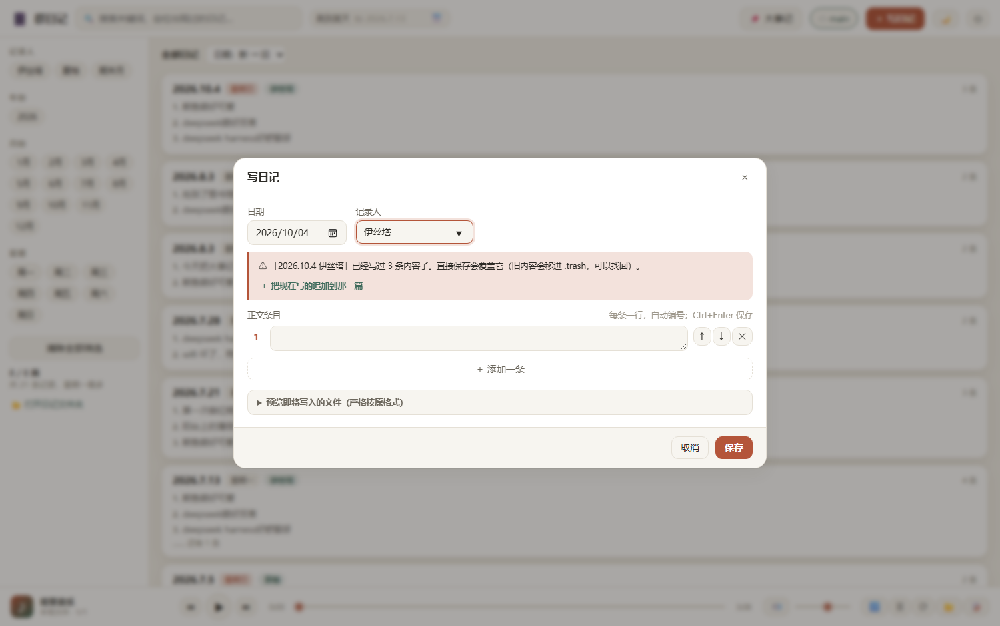 |
| 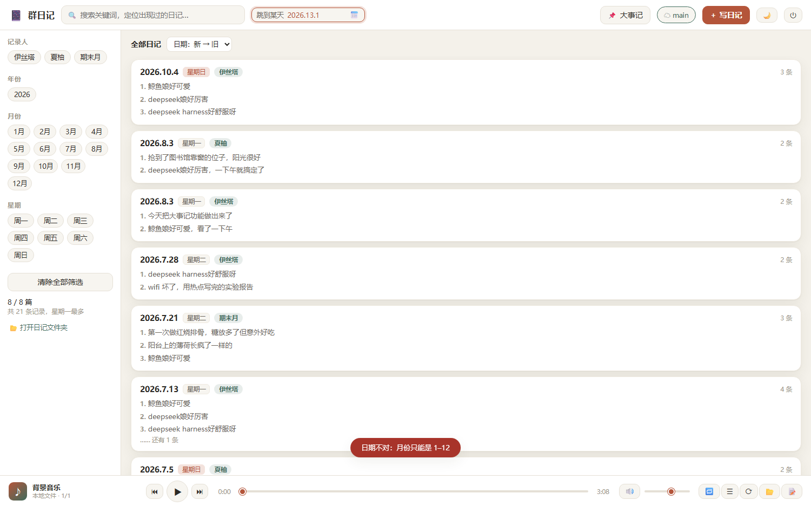 | 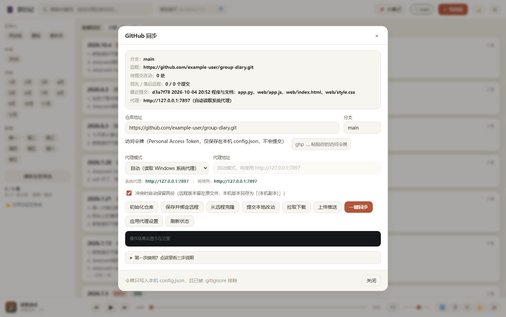 |

**大事记：**

| | |
|---|---|
| 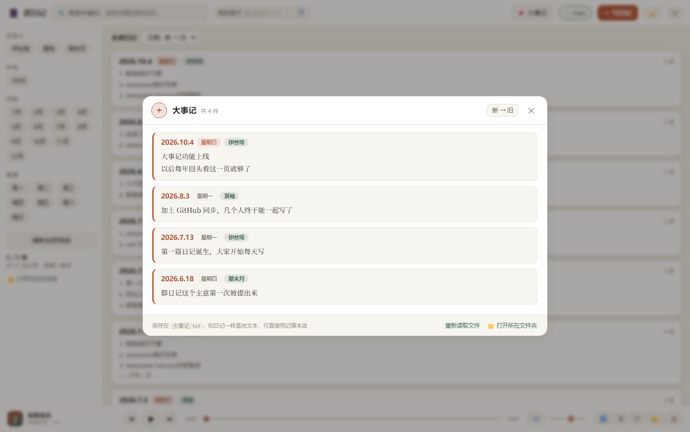 | 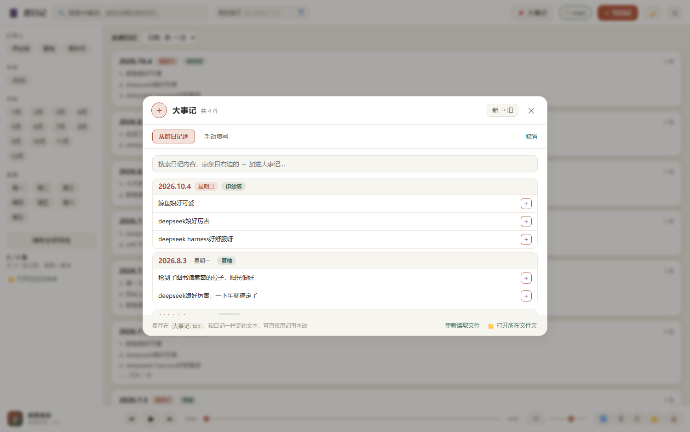 |

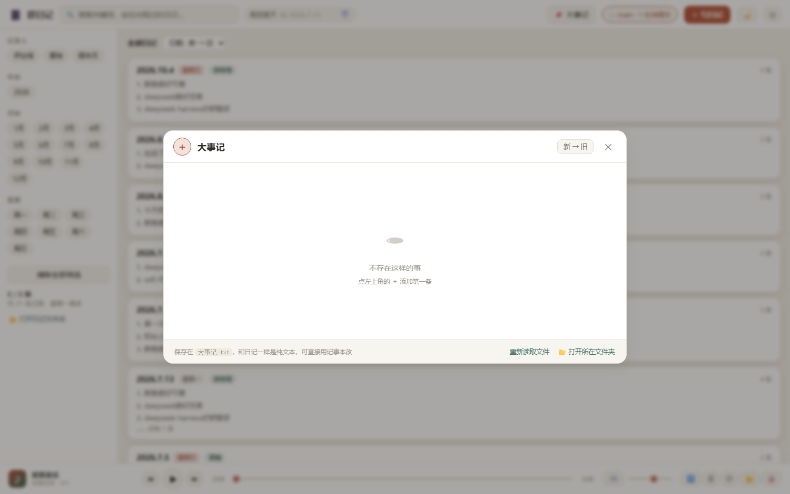

---

## 一、启动

**双击 `启动群日记.pyw`**（推荐）。程序会自动在本地起一个服务，并用一个**独立的应用窗口**
打开界面（Edge/Chrome 的应用模式，有自己独立的窗口和任务栏图标，看起来就是一个桌面软件）。
这条路径完全绕开 cmd.exe，不会闪黑色窗口。

三个入口的分工：

| 文件 | 用途 |
|---|---|
| **`启动群日记.pyw`** | 日常用这个。双击即开，无命令行窗口，出错会弹中文对话框 |
| `启动群日记.bat` | 兜底。万一 `.pyw` 的文件关联被破坏（比如装过别的 Python 发行版），用这个 |
| `调试启动-显示日志.bat` | 排错用。保留黑色控制台并打印运行日志和访问地址 |

**退出程序**：点界面右上角的 **⏻** 按钮。
（程序本质是一个后台进程，直接关窗口不会退出它；⏻ 会干净地停掉服务。实在卡住了就开任务管理器结束 `pythonw.exe`。）

- 如果应用窗口没弹出来，用 `调试启动-显示日志.bat`，它会打印地址，手动在浏览器打开即可。
- 服务只监听 `127.0.0.1`，局域网内其他机器访问不到。

> **为什么两个 `.bat` 里全是英文？**
> 中文版 Windows 的 cmd.exe 按 GBK(936) 解析批处理文件。如果 `.bat` 里出现 UTF-8 中文，
> GBK 解码会产生「落单的前导字节」，把后面的字符甚至换行符一起吞掉，脚本就会报
> `'t' 不是内部或外部命令` 这类错并直接跑不起来（`chcp 65001` 写在文件里也没用，
> 因为解析发生在它生效之前）。所以这两个 `.bat` 被刻意约束为**纯 ASCII + CRLF**，
> 中文提示全部交给 `启动群日记.pyw` 和 `app.py`（Python 源码是 UTF-8，不受影响）。

## 二、目录结构

```
群日记/
├─ 启动群日记.pyw           ← 双击这个（推荐）
├─ 启动群日记.bat           ← 兜底入口
├─ 调试启动-显示日志.bat     ← 出问题时用这个看日志
├─ app.py                  ← 程序本体（Python 标准库，零第三方依赖）
├─ web/                    ← 界面文件
├─ 截图/                    ← 界面预览图
├─ diaries/                ← 所有日记 .txt 都在这里（唯一数据源）
├─ music/                  ← 背景音乐
│   └─ sources.txt         ← 音源清单（可写可不写）
├─ logs/app.log            ← 运行日志
├─ .trash/                 ← 删除的日记会先移到这里
├─ config.json             ← 本机设置（含 GitHub 令牌，已被 .gitignore 排除）
└─ .gitignore
```

## 三、功能

### 记录

- 右上角 **＋ 写日记**，或按 <kbd>N</kbd>。
- 日期 + 记录人 + 一条条正文，自动编号。
- 编辑框里：<kbd>Enter</kbd> 新建下一条，<kbd>Backspace</kbd> 在空行上删除并回退，
  <kbd>Ctrl</kbd>+<kbd>Enter</kbd> 保存，右侧 <kbd>↑</kbd><kbd>↓</kbd> 调整顺序。
- 保存时严格按原格式写回 `diaries/`，UTF-8 无 BOM、LF 换行，和你手写的一模一样。
- 展开「预览即将写入的文件」可以确认落盘内容。

**关于「同一天写多篇」——这一点很重要：**

日记的文件名是 `日期 记录人.txt`，所以：

| 情况 | 结果 |
|---|---|
| 同一个人，**不同天** | ✅ 各自独立的文件，互不影响 |
| **同一天**，不同的人 | ✅ 两个文件（`2026.7.13 伊丝塔.txt` 和 `2026.7.13 夏柚.txt`），互不影响 |
| 同一个人，**同一天**写第二次 | ⚠️ 文件名相同，**属于同一篇**。程序会拦住你 |

同一天同一个人想补记时，程序会在编辑器里直接提示：

> ⚠ 「2026.10.4 伊丝塔」已经写过 2 条内容了。直接保存会覆盖它（旧内容会移进 `.trash`，可以找回）。
> **＋ 把现在写的追加到那一篇**

点那个按钮就会把新写的几条**接在原来内容后面**，这是补记的正确姿势。

万一点了保存，程序还会再弹一次确认；确认覆盖后，**旧内容也会先移进 `.trash`**，
不会无声无息地消失。想找回就去 `群日记/.trash/` 找带时间戳的那个文件。

### 1. 搜索

- 顶部搜索框：**全文关键词搜索**，命中处会高亮；多个关键词用空格分隔，表示「同时包含」。
- 搜索范围包括正文、记录人、日期。
- 右上角 **跳到某天**：**直接手输**即可，支持 `2026.7.13`、`2026-7-13`、`2026/7/13`、`20260713`、
  `2026年7月13日` 这些写法；也可以点旁边的小日历图标挑。
  输入不合法时会**立刻飘一条红色提示并说明原因**（比如「月份只能是 1–12」「2026年2月没有 30 号」），
  同时输入框变红。回车确认，<kbd>Esc</kbd> 撤销输入。
- 快捷键 <kbd>/</kbd> 聚焦搜索框。

### 2. 筛选

左侧栏可以任意组合：

| 维度 | 说明 |
|---|---|
| 记录人 | 点选一个或多个 |
| 年份 | 点选 |
| 月份 | 1–12 月点选 |
| 星期 | 周一～周日，**由日期自动推算**，不需要手写 |

还支持排序：日期新旧、按记录人、按条数。「清除全部筛选」一键复位。

### 3. 背景音乐

两种增减音源的方式，随你挑：

- **丢文件就行**：把 `.mp3/.wav/.ogg/.flac/.m4a/.aac/.opus` 放进 `music/`（支持子文件夹），
  播放器自动出现；删掉文件就消失。点 ⟳ 重新扫描。
- **写清单**：编辑 `music/sources.txt`，一行一个，顺序即播放顺序，还能写 `https://` 网络直链/电台。
  界面右下角 **📝** 按钮可以直接在程序里改。

播放器支持播放/暂停、上一首/下一首、进度拖动、音量、四种循环模式（列表/单曲/随机/播完停止）、播放列表。
快捷键：<kbd>空格</kbd> 播放暂停。

配置文件 `music/sources.txt` 里写了什么，程序就放什么；清单为空则自动扫描整个 `music` 文件夹。

### 4. 界面布局

- **拖动中间的分界线**：自由调整「列表」和「正文」的宽度比例。
- 分界线中间有个 **⇄** 按钮：点一下就把**日记列表和正文左右对调** —— 习惯左文右表的话很方便。
- **双击分界线**：宽度恢复默认。
- 两个设置都会记住，下次打开还是你选的样子。

### 5. GitHub 同步

点右上角的 Git 状态徽章打开面板。三步：

1. 在 GitHub 新建一个空仓库（私有也行），把地址填进「仓库地址」。
2. 生成访问令牌：GitHub → *Settings → Developer settings → Personal access tokens* →
   新建 **Fine-grained token**，仓库权限给 **Contents: Read and write**，粘贴进「访问令牌」。
3. 点「保存并绑定远程」，以后每次写完日记点一次「一键同步」。

**多人共享**：把整个 `群日记` 文件夹（或压缩包）给对方 → 对方填同一个仓库地址和自己的令牌 →
点「从远程克隆」。之后各自「一键同步」即可。

关于冲突：如果两个人同时改了**同一篇**日记，Git 会冲突。程序默认自动处理——
**远程版本保留在原文件，本机版本另存为 `xxx (本机副本 MMdd-HHmm).txt`**，两边都不丢，
不会有任何内容被静默覆盖。可以在面板里关掉这个行为。

> 令牌只保存在本机 `config.json`，并且已在 `.gitignore` 中排除，不会被提交到仓库。

**连不上 GitHub 怎么办？** 面板里有「代理模式」一栏：

| 模式 | 什么时候用 |
|---|---|
| **自动（读取 Windows 系统代理）** ⭐ | 默认。每次同步前自动读取你浏览器在用的那个代理，换端口也能跟上 |
| 手动指定 | 自动读取不到，或想指定别的端口 |
| 不使用代理 | 你的网络本来就能直连 GitHub |

改完点一下「应用代理设置」即可。**为什么需要这个**：浏览器会自动读系统代理，而 git 完全不读，
所以会出现"浏览器能打开 GitHub，一键同步却失败"。详细说明见
[GitHub同步操作指南.md](GitHub同步操作指南.md) 第十节。

失败时程序会用中文给出下一步建议，不用自己啃英文报错。

### 6. 大事记

顶部 **📌 大事记** 按钮。它和日记是两回事：日记是流水账，大事记只记**值得回头看的节点**。

点开后是一个居中的面板，四周变暗（**点暗处**或右上角 **✕** 都能退出）：

| 位置 | 作用 |
|---|---|
| **左上角 ＋** | 添加。鼠标移上去会放大高亮 |
| **右上角 ✕** | 退出 |
| 右上角「新 → 旧」 | 切换排序，点一下变成「旧 → 新」 |
| **鼠标移到某一条上** | 右下角浮出 **🗑 删除** |
| 一条都没有时 | 显示 **「不存在这样的事」** |

点 ＋ 后有两种添加方式：

- **从群日记选** —— 列出全部日记，点条目右边的 ＋ 直接搬进来，**自动带上那天的日期和记录人**；
  已经加过的会置灰，防止重复
- **手动填写** —— 自己写日期、记录人、正文（正文可多行）

数据存在程序根目录的 **`大事记.txt`**，和日记一样是纯文本：

```
2026.7.13 伊丝塔
第一篇日记诞生，大家开始每天写
END

2026.10.4 伊丝塔
大事记功能上线
以后每年回头看这一页就够了
END
```

一条 = 一个「日期 记录人 / 正文 / END」的块，块之间用空行隔开，正文可以多行。
在程序里增删会直接改写这个文件；你也可以用记事本直接写，写完点「重新读取文件」。

这个文件会跟着一起同步到 GitHub，所以全群共用一份。

## 四、日记文件格式说明

程序对格式很宽容，但标准格式如下：

```
YYYY.M.D 记录人
1.第一条
2.第二条
END
```

- 第一行：日期 + 空格 + 记录人。日期支持 `2026.7.13` / `2026-07-13` / `2026年7月13日`。
- 正文：`序号.内容`，序号符号支持 `.` `、` `．` `:` `：` `)` `）`。
- 没有序号的行会自动并入上一条（保持内容不丢）。
- 最后一行 `END`（也认 `end` / `完` / `结束`）。
- 文件名约定为 `2026.7.13 伊丝塔.txt`；如果首行格式有问题，程序会尝试从文件名推断日期和记录人。
- 缺 `END`、缺序号等问题不会导致数据丢失，界面上会给出 ⚠ 提示，保存一次即可修正。
- 程序写回时统一用 UTF-8 无 BOM、LF 换行，并在**结尾补一个换行**（你原来那篇文件末尾没有换行，
  这是唯一的一处差异；补上换行是为了让 git 协作时不再出现 “\ No newline at end of file”，避免每次同步都产生无意义改动）。

### URL 深链（可以把某个筛选结果收藏成快捷方式）

在地址后面加参数即可，例如：

```
http://127.0.0.1:8756/?q=鲸鱼娘                    搜索关键词
http://127.0.0.1:8756/?date=2026-07-13             只看某一天
http://127.0.0.1:8756/?recorder=伊丝塔,夏柚         只看这些记录人
http://127.0.0.1:8756/?open=2026.7.13 伊丝塔        直接打开这一篇
http://127.0.0.1:8756/?new=1                       打开就进入写日记
http://127.0.0.1:8756/?ms=1                        打开大事记
http://127.0.0.1:8756/?git=1                       打开 GitHub 同步面板
```

## 五、常见问题

**Q：能直接用记事本改日记吗？**
可以。程序每次操作都会重新读取磁盘，改完在界面上点一下筛选或刷新即可看到。

**Q：能用 VSCode / Obsidian 打开吗？**
能，`.txt` 都是普通文本。

**Q：需要联网吗？**
不需要。只有 GitHub 同步和网络音源才需要联网。

**Q：日记存在哪里？想把数据搬到 D 盘行不行？**
整个 `群日记` 文件夹可以整体复制到任何位置，程序用相对路径，搬完照样跑。

**Q：点了新按钮却报「服务器返回异常」或者「没有 /api/xxx 这个接口」？**

这说明 **程序文件更新了，但当前跑着的还是旧版本**。

原因：界面文件（`web/` 里的东西）是**每次刷新都从磁盘重读**的，而 `app.py` 是**启动时读进内存**的。
所以会出现"新界面配旧后台"—— 界面上有新按钮，点下去后台却根本没见过这个接口。

症状：顶部会多出一条红色提示条：

> ⚠ 程序文件已经更新，但当前运行的还是**旧版本**，新加的功能点下去会报错。
> 点右上角 **⏻** 退出，然后重新双击 **启动群日记.pyw** 就好。

按提示做即可。**只要看到那条红条，就说明该重启了。**

## 六、快捷键总览

| 键 | 作用 |
|---|---|
| <kbd>/</kbd> | 聚焦搜索框 |
| <kbd>N</kbd> | 新建日记 |
| <kbd>空格</kbd> | 播放 / 暂停背景音乐 |
| <kbd>J</kbd> / <kbd>K</kbd> | 阅读面板下一篇 / 上一篇 |
| <kbd>Esc</kbd> | 关闭弹窗 / 播放列表 / 阅读面板 |
| <kbd>Ctrl</kbd>+<kbd>Enter</kbd> | 在编辑器中保存 |
